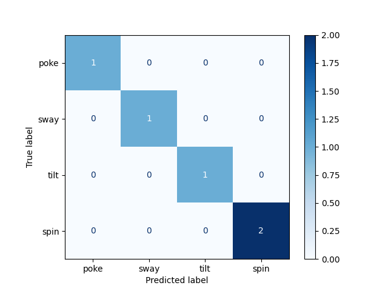

# Bear Interaction Activity Classification and IMU Signal Processing

This repository contains the codebase for collecting, processing, visualizing, and classifying IMU sensor signals from a bear interaction enrichment activity system.

## Project Scope

- IMU data collection on M5StickC Plus2 (`m5stick/`)
- Signal preprocessing and ELAN export utilities (`Data collection/`)
- Plotting and activity classification scripts (`Plotting/`)
- Activity classes used in experiments: `poke`, `sway`, `tilt`, `spin`

## Repository Structure

- `m5stick/`: Firmware sketches for on-device IMU capture and retrieval
- `Data collection/`: Raw/processed datasets, behavior sessions, ELAN formatting scripts, and graph outputs
- `Plotting/`: Visualization scripts, confusion matrix generation, and decision-tree based activity classification

## Quick Start

1. Install Python dependencies:
   - `pandas`
   - `numpy`
   - `matplotlib`
   - `scikit-learn`
2. Run plotting/classification scripts from the `Plotting/` directory, for example:
   - `python plot.py`
   - `python confusion-matrix.py`
   - `python decision-tress.py`

## Research Images

### Sensor Signal Visualization

### Model Result Visualization

### Behavior Capture Example

## Notes

- Generated and raw files are kept in their original folders for reproducibility.
- This repo is focused on bear interaction activity classification and IMU signal processing artifacts.
